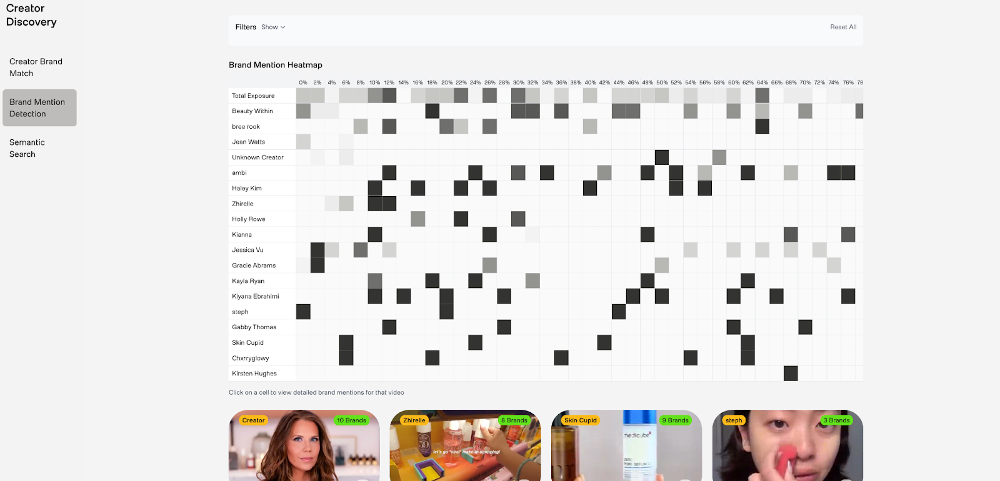
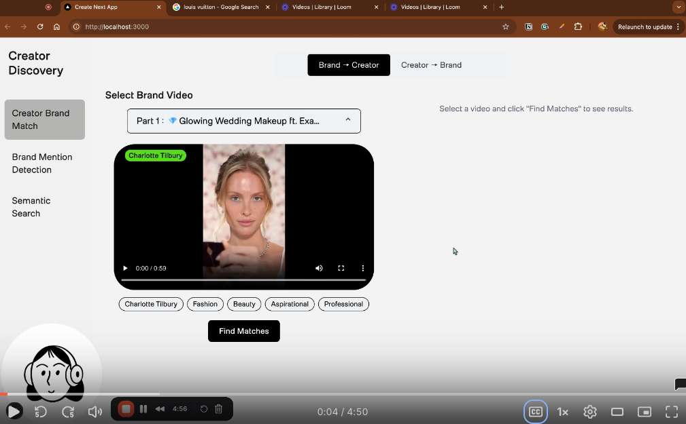
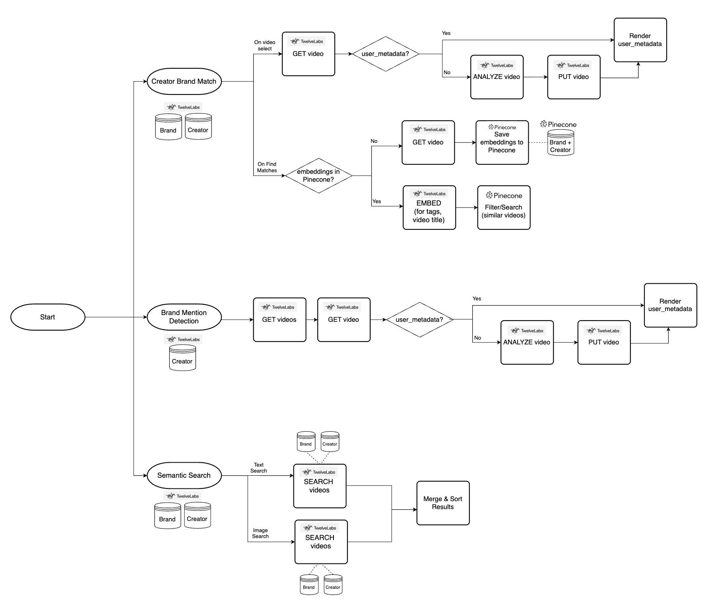

# Creator Discovery

Creator Discovery is a Next.js 15 application that showcases Twelve Labs video-understanding technology through three production-ready demos:

1. **Creator – Brand Match** – find the best creator videos for a given brand video (and vice-versa) using multimodal embeddings stored in Pinecone.
2. **Semantic Search** – unified text & image search across brand/creator indices with rich facet filtering.
3. **Brand Mention Detection** – automatic extraction and visualization of brand/product appearances inside creator videos.

Together these features illustrate how to combine Twelve Labs APIs with vector search and modern React tooling to build powerful media-intelligence products.

📌 [Demo](https://creator-discovery.vercel.app/)
[](https://creator-discovery.vercel.app/)

## App Demo Video

[](https://www.loom.com/share/2f82fa0e05c44ae5a23a300af114f011?sid=d1e95613-75c7-4499-9a07-1c54a920c999)

---

## Key Features

| Feature                     | Highlights                                                                                                                                                                                                                                                                                                                                                                         |
| --------------------------- | ---------------------------------------------------------------------------------------------------------------------------------------------------------------------------------------------------------------------------------------------------------------------------------------------------------------------------------------------------------------------------------- |
| **Creator–Brand Match**     | • Generates text & video embeddings (Twelve Labs Embed API) <br>• Stores/queries in Pinecone <br>• Bidirectional _Source → Target_ toggle (Brand→Creator default) <br>• React Query powered dropdown & results grid                                                                                                                                                                |
| **Semantic Search**         | • Text **and** image search (Search API) <br>• Optional image cropping modal before search <br>• Filters: All / Brands / Creators scope, Vertical / Horizontal format <br>• Clickable thumbnails open a modal preview on the exact time-range                                                                                                                                      |
| **Brand Mention Detection** | • Uses **Analyze** API with a structured prompt to extract product events <br>• Preservation of individual segments (no deduplication) <br>• Library & per-video heatmaps with _Total Exposure_ summary row (50 time buckets) <br>• Event description and location details in video modal <br>• Filters: creators, formats, styles, tones, brands, duration threshold, time window |

---

## Architecture & Design

### Tech Stack

- **Next.js 15 App Router** (SSR + API routes)
- **TypeScript** throughout
- **React Query** for data-fetching / caching
- **TailwindCSS v3.4** with inline CSS variables
- **Pinecone** vector DB for embeddings

### End-to-End Workflow



### Project Structure (highlights)

```
src/
  app/
    page.tsx                       ← main entry page with tab navigation
    creator-brand-match/           ← feature page 1 (page.tsx)
    semantic-search/               ← feature page 2
    brand-mention-detection/       ← feature page 3
    admin/                         ← admin page for video management
    api/
      embeddingSearch/…            ← textToVideo & videoToVideo routes
      search/{text,image,byToken}  ← semantic search routes
      brand-mentions/{analyze,events}
      videos/…                     ← Twelve Labs video proxy routes
      vectors/{exists,store,check-status,test-connection}
      proxy-image/route.ts         ← remote image CORS proxy
  components/
    Heatmap.tsx, VideoModalSimple.tsx, VideosDropdown.tsx …
  providers/
    ReactQueryProvider.tsx
  utils/
    pinecone.ts, heatmap.ts
  types/
    index.ts, brandMentions.ts
```

---

## Setup & Configuration

### Environment Variables

Create `.env.local` (or copy the example) with:

```
TWELVELABS_API_KEY=YOUR_API_KEY
TWELVELABS_API_BASE_URL=https://api.twelvelabs.io/v1.3
NEXT_PUBLIC_BRAND_INDEX_ID=YOUR_INDEX_ID
NEXT_PUBLIC_CREATOR_INDEX_ID=YOUR_INDEX_ID
PINECONE_API_KEY=YOUR_PINECONE_KEY
PINECONE_INDEX=YOUR_PINECONE_INDEX
```

### Install & Run

```bash
# install deps
npm install

# dev server (http://localhost:3000)
npm run dev

# production build
npm run build
npm start
```

---
